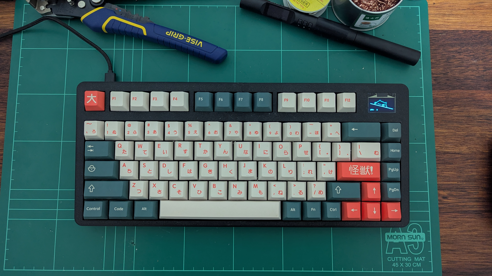
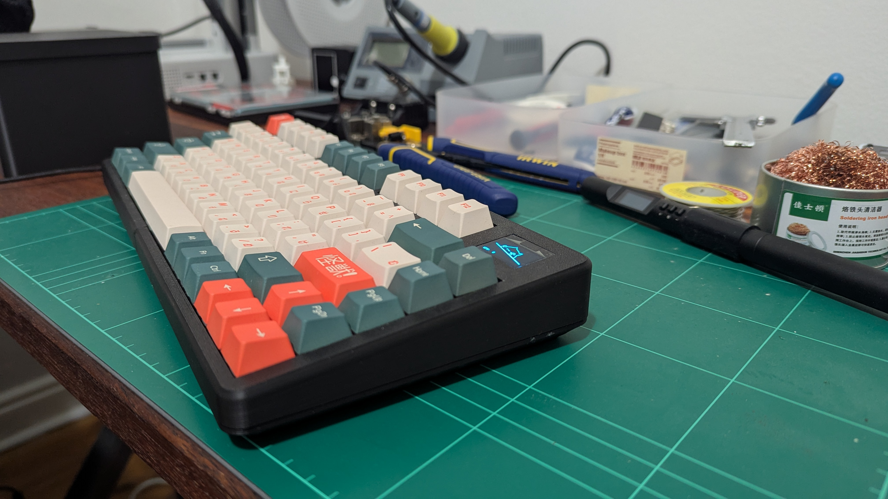
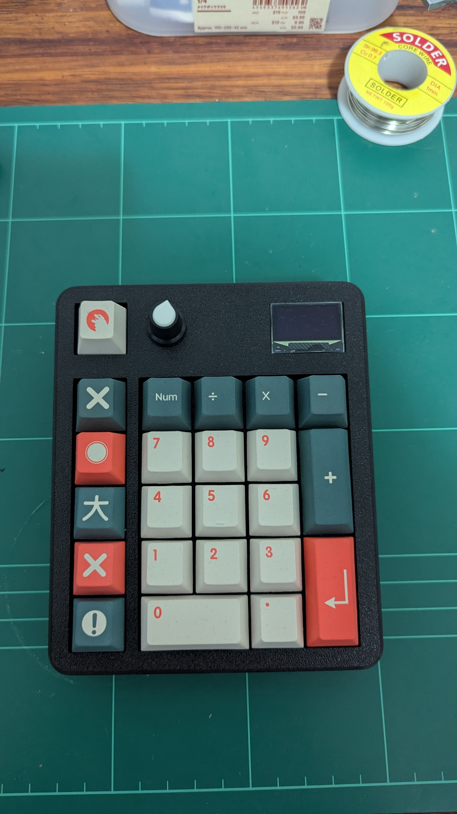

<h1>Bongo Boards</h1>

A series of three custom boards featuring an interactive OLED screen!
And yes, of course they run DOOM.

<h2>Bongo 75</h2>
A 75%-ish (basically a 68% with an F-row) 3D printed board. This is the culmination of the knowledge gained from the two previous boards, and is the recommended option if you wish to follow along at home.

 

 

<h2>DoomPad</h2>
A 3D printed standalone numpad.

 

<h2>Bongo80</h2>
An 80% TKL layout using a KBDFans tiger lite chassis, but handwired with an OLED. This was the prototype for the boards that came after it, and suffered greatly from my inability to manufacture plates and cases at the time.

 

